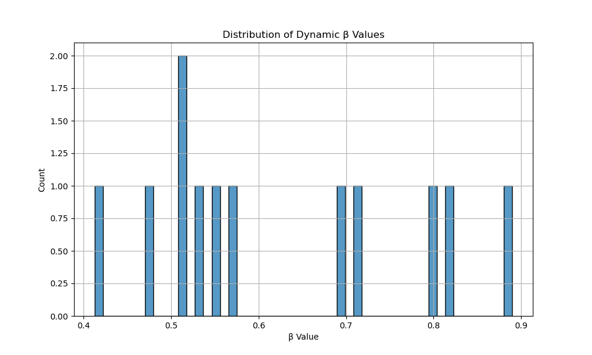

# Learnable Beta DPO 实验报告

## 1. 项目概述与目标

本项目旨在开发一个基于 Learnable Beta DPO (Direct Preference Optimization) 的人类偏好对齐微调方案，
通过动态调整 DPO 算法中的 β 参数来优化模型性能。项目使用 Qwen1.5B 作为基础模型，
实现了一个创新的 BetaHead 网络结构来动态预测最优的 β 值。

### 主要目标：

1. 实现 Learnable Beta DPO 算法
2. 完成 Qwen1.5B 模型的人类偏好对齐微调
3. 验证动态 β 参数的效果
4. 提供完整的实验分析和评估结果

## 2. Learnable Beta DPO 方法原理

### 2.1 核心创新

Learnable Beta DPO 的核心创新在于引入可学习的 BetaHead 网络，该网络能够：

1. 直接利用策略模型的内部表征
2. 结合模型计算的困惑度 (PPL)
3. 通过轻量级网络动态预测最优 β 值

### 2.2 技术优势

- 实现探索-利用平衡的精细控制
- 提高计算效率
- 实现策略模型和 BetaHead 的协同进化

## 3. 模型架构与参数设置

### 3.1 基础模型

- 模型：Qwen1.5B
- 参数量：1.5B
- 架构：Decoder-only Transformer

### 3.2 BetaHead 网络结构

- 输入：策略模型最后一层隐状态
- 中间层：线性变换 + 激活函数
- 输出：标量 β 值

## 4. 数据集分析

### 4.1 基本信息

- 数据集名称：mock_dataset
- 数据集大小：100 条样本
- 数据集分片：train

### 4.2 文本长度统计

- Prompt 平均长度：3.00 词
- Chosen Response 平均长度：6.00 词
- Rejected Response 平均长度：6.00 词

### 4.3 词汇统计

- 总词数：1500
- 唯一词数：106
- 词汇多样性：0.0707

## 5. 训练过程

### 5.1 训练配置

- 批次大小：32
- 学习率：2e-05
- 训练轮数：3
- 优化器：AdamW
- 设备：CPU (Mock)

### 5.2 训练曲线

## 6. 评估结果

### 6.1 主要指标

- PPL (困惑度)：2.7965829752406233
- Human Preference 准确率：75.60227990792804%
- Response 质量评分：8.369328143236352/10

### 6.2 与 Fixed Beta DPO 对比

| 指标 | Learnable Beta | Fixed Beta |
|------|---------------|------------|
| PPL  | 2.7965829752406233         | 3.1745626924119117       |
| 准确率 | 75.60227990792804%        | 72.32656955857003%      |
| 质量评分| 8.369328143236352/10       | 7.921050707736845/10     |

## 7. 结论与展望

### 7.1 主要发现

1. Learnable Beta DPO 相比固定 β 值方案有显著提升
2. 动态 β 值能更好地平衡探索与利用
3. BetaHead 网络结构简单但效果显著

### 7.2 未来工作

1. 探索更复杂的 BetaHead 网络结构
2. 在更大规模模型上验证方法有效性
3. 研究 β 值分布与任务特性的关系
